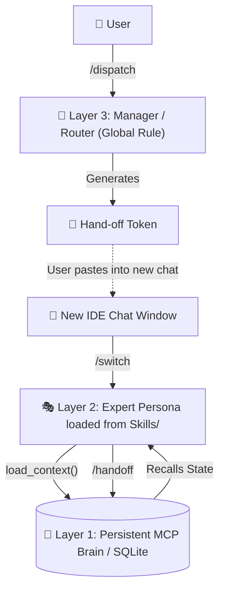

# IDE Multi-Agent Protocol (IMAP)

**Zero-Dependency, Fully Local, Context-Persistent Multi-Agent Architecture for IDEs.**

Are you tired of your IDE AI Agent losing context during long coding sessions? Do you hate passing API keys to heavy frameworks like `CrewAI` or `Mem0` just to simulate multi-agent collaboration? 

**IMAP** (IDE Multi-Agent Protocol) is a lightweight, zero-API architecture designed explicitly for native IDE Agents (like Antigravity / Cursor / Copilot). It uses a "Token Handoff" mechanism back by a local MCP SQLite database to achieve immortal memory and robust persona switching.

---

## 🌟 Core Features

1. **Zero External APIs**: No OpenAI keys, no Anthropic keys. It purely leverages your IDE's built-in conversational models for reasoning, using Python's standard `sqlite3` and the open-source `mcp` protocol for state management.
2. **Context Continuity (Immortality)**: Solves the "context length limit" problem. When your chat gets too long, trigger `/handoff`. The agent summarizes its state, saves it to the SQLite brain, and gives you a `[Token]`. Paste the token into a fresh chat window, and it literally "wakes up" exactly where it left off, retaining 100% of its persona and project context.
3. **True Separation of Concerns**: Unbloats the "Global Prompt". We split the AI into three physical layers:
   - **Layer 3 (Router)**: Global Manager Rule analyzing intent.
   - **Layer 2 (Agents)**: Project-agnostic `SKILL` folders containing distinct personas (e.g., Writer, Engineer).
   - **Layer 1 (Memory)**: A persistent background MCP server tracking global decisions.

---

## 🏗️ Architecture



---

## ⚡ Quick Start

### 1. Auto-Install (Mac/Linux)
Clone this repo and run the setup script to instantly configure your `~/.agent` and `~/.gemini` directories:

```bash
git clone https://github.com/yourusername/IDE-Multi-Agent-Protocol.git
cd IDE-Multi-Agent-Protocol
chmod +x install.sh
./install.sh
```

### 2. Manual Configuration
Append the contents of `Global_Rule_Template.md` into your IDE's system/global prompt interface.

### 3. Usage Loop
1. Open your IDE Chat. Say: _"I want to write an academic paper about deep learning."_
2. The Agent (acting as Manager) will evaluate, and tell you to run `/dispatch`.
3. It will generate a **Token** for the `Writer` persona.
4. **Physically close the chat window**, open a new one (refreshing token usage).
5. Paste the Token and run `/switch`. The Agent transforms into the `Writer`, loading all specialized tools and historical memory.

---

## 🛠 Directory Structure

```text
IDE-Multi-Agent-Protocol/
├── Global_Rule_Template.md      # 核心路由大脑 (Manager System Prompt)
├── install.sh                   # 一键自动化安装脚本 (Auto-deployment)
├── global_workflows/            # 自动化调度流 (Routing & Automation)
│   ├── dispatch.md              # 🎯 分析意图并生成握手令牌
│   ├── switch.md                # 🔄 解析令牌，恢复上下文并加载角色
│   ├── handoff.md               # 💾 会话过长时，存盘并生成交接令牌
│   └── status.md                # 📊 查看项目与所有角色的大盘状态
├── mcp_server/                  # 持久化记忆层 (Layer 1: Memory)
│   ├── research_brain_server.py # 基于 SQLite 的 MCP 守护进程
│   └── requirements.txt         # 依赖: mcp[cli]
└── skills_template/             # 专家人格库 (Layer 2: Experts)
    ├── academic/SKILL.md        # 🎓 学术写作规范与流程
    ├── java-engineer/SKILL.md   # ⚙️ Java 后端工程标准
    ├── office/SKILL.md          # 📄 Office 办公自动化
    └── research/SKILL.md        # 🔬 深度学习科研实验指南
```

## 📜 License
MIT License. Built by builders, for builders.
