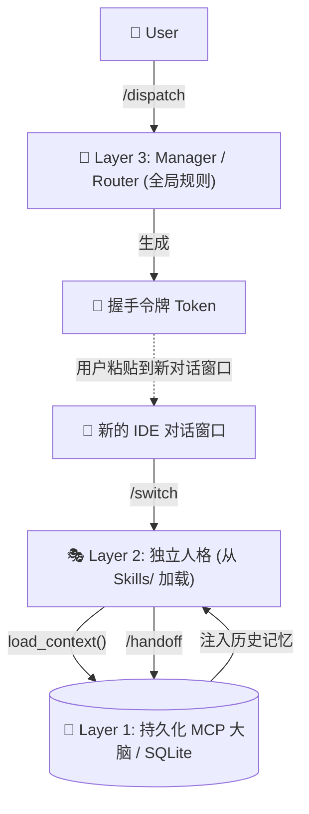

[English](README.md) | **中文说明**

# IDE Multi-Agent Protocol (IMAP) IDE 多智能体接力协议

**零依赖、纯本地化、上下文持久的 IDE 原生多智能体架构。**

你是否受够了 IDE 上的 AI 助手在长对话中不断遗忘上下文？你是否厌倦了仅仅为了模拟多智能体协作，就不得不把 API 密钥交给像 `CrewAI` 或 `Mem0` 这样笨重的外部框架？

**IMAP** (IDE Multi-Agent Protocol) 是专门为原生 IDE 助手 (如 Antigravity / Cursor / Copilot) 设计的轻量级零外部 API 架构。它使用“令牌交接 (Token Handoff)”机制，借助本地 MCP SQLite 数据库底层，实现永久跨越会话的记忆与稳健的角色切换。

---

## 🌟 核心卖点

1. **零外部 API**: 不需要 OpenAI 密钥，不需要 Anthropic 密钥。它纯粹利用你 IDE 内置的免费对话模型进行推理，使用底层 Python 标准库 `sqlite3` 和开源的 `mcp` 协议来进行状态管理。
2. **上下文永生**: 完美解决大模型“上下文长度限制”导致的遗忘问题。对话过长时，触发 `/handoff` 工作流，Agent 会自我总结状态，存入 SQLite 数据库里，并交给你一个 `[握手令牌 Token]`。关闭旧对话，在新对话中粘贴这个令牌，AI 就会立刻携带前面 100% 的记忆和身份信息“原地复活”。
3. **架构解耦 (三层立体结构)**: 告别把所有设定塞进“系统提示词”的时代。我们把 AI 物理拆分为三层：
   - **Layer 3 (Router)**: 全局管理规则，负责调度和解析意图。
   - **Layer 2 (Agents)**: 与项目无关的 `SKILL` 专业目录，内含不同人格（如作家、工程师）。
   - **Layer 1 (Memory)**: 后台常驻的 MCP 服务进程，负责跨对话的宏观记忆追踪。

---

## 🏗️ 架构逻辑



---

## ⚡ 快速体验

### 1. 自动安装 (Mac/Linux)
克隆本项目并执行安装脚本，秒速初始化您的 `~/.agent` 和 `~/.gemini` 核心目录：

```bash
git clone https://github.com/anyun-hy/IDE-Multi-Agent-Protocol.git
cd IDE-Multi-Agent-Protocol
chmod +x install.sh
./install.sh
```

### 2. 手动配置
打开您的 IDE，找到 Global Prompt / System Rule 设置项，将本仓库下 `Global_Rule_Template.md` 的内容全部追加进去。

### 3. 使用流程规范
1. 打开 IDE 对话框，输入：_"我想写一篇关于深度学习的论文。"_
2. Agent（此时扮演调度的 Manager）会进行评估，并要求你执行 `/dispatch` 命令。
3. 它会为你生成一张专门给 `Writer`(作家) 人格的 **Token 握手令牌**。
4. **手动关闭当前对话框**，点开一个全新、干净的对话框（彻底刷新上文占用流）。
5. 把刚才那张令牌粘贴发送进去，并执行 `/switch`。Agent 就会化身 `Writer`，同时从 MCP 数据库中抽取相关能力与所有历史记录。

---

## 🛠 目录结构全览

```text
IDE-Multi-Agent-Protocol/
├── Global_Rule_Template.md      # 核心路由大脑 (Manager System Prompt)
├── install.sh                   # 一键自动化安装脚本 (Auto-deployment)
├── global_workflows/            # 自动化调度流 (Routing & Automation)
│   ├── dispatch.md              # 🎯 分析意图并生成握手令牌
│   ├── switch.md                # 🔄 解析令牌，恢复上下文并加载角色
│   ├── handoff.md               # 💾 会话过长时，存盘并生成交接令牌
│   └── status.md                # 📊 查看项目与所有角色的大盘状态
├── mcp_server/                  # 持久化记忆层 (Layer 1: Memory)
│   ├── research_brain_server.py # 基于 SQLite 的 MCP 守护进程
│   └── requirements.txt         # 依赖: mcp[cli]
└── skills_template/             # 专家人格库 (Layer 2: Experts)
    ├── academic/SKILL.md        # 🎓 学术写作规范与流程
    ├── java-engineer/SKILL.md   # ⚙️ Java 后端工程标准
    ├── office/SKILL.md          # 📄 Office 办公自动化
    └── research/SKILL.md        # 🔬 深度学习科研实验指南
```

## 📜 许可协议
MIT License. Built by builders, for builders.
